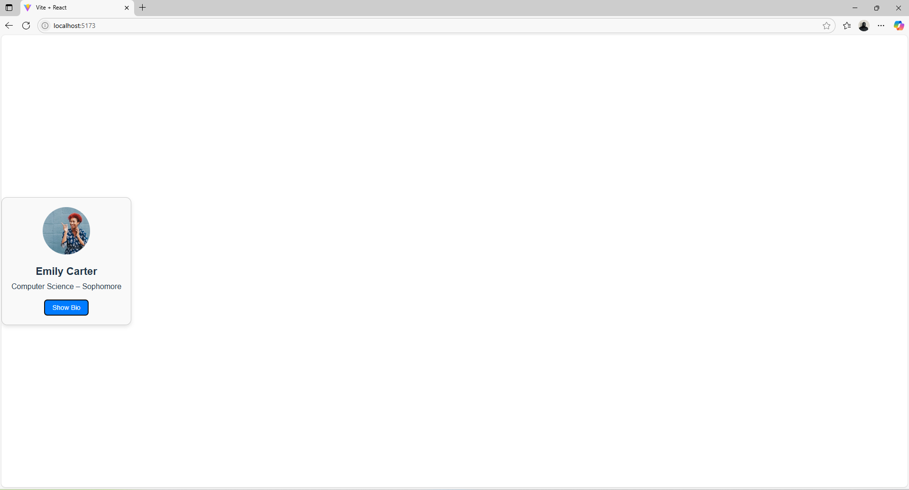
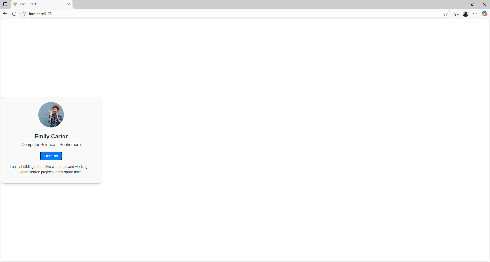

# Module 10A – StudentCard Code Review

## Description
- The StudentCard component is the main focus of this React code review assignment.  
- Using **props** to pass dynamic data into the component and **state** via React's `useState` hook to control UI interactivity were both carefully examined during the review.  
- I included thorough comments to make clear how information moves between parent and child components and how component-level state offers a user-friendly method of turning on UI elements like the student's biography.  
- In order to make components easier to comprehend and reuse, this exercise highlighted the significance of clear, maintainable code and thorough inline documentation.

## What I Learned
- How components are made reusable by accepting different props, and how **props** act as the interface for passing data.
- The function of **state** in regulating user interface behavior, particularly how `useState` enables components to "remember" data between renders and react to user input in real time.
- The **toggle functionality** is accomplished by enabling conditional rendering based on state values, updating state, and causing React to re-render.
- The importance of including precise, unambiguous comments to improve code readability and facilitate teamwork.
- Understanding how React component composition functions: child components independently manage their own internal state, while the parent `App` passes data downward.
- Understanding React's declarative UI paradigm, which places a strong emphasis on state and UI and directs the developer's attention away from manual DOM manipulation and toward state-driven views.

## Screenshot

---

## App.jsx
